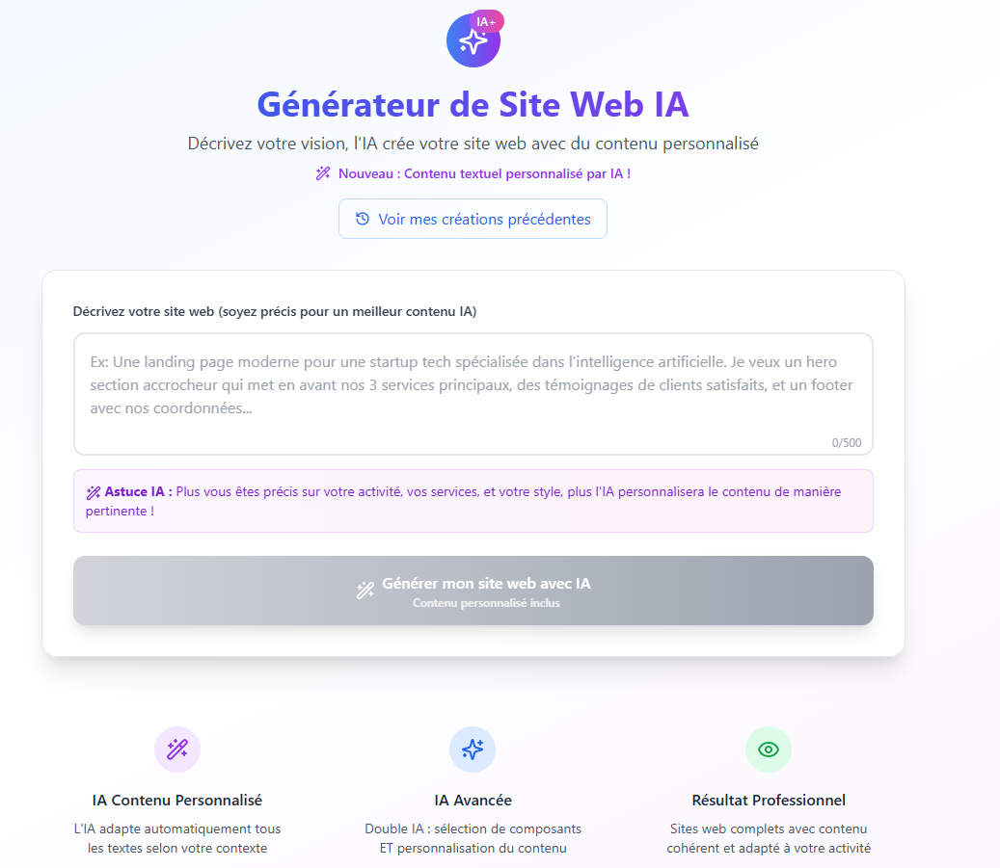

# 🤖 AI Website Generator - Double IA

> Générateur de sites web avec intelligence artificielle double : sélection automatique de composants + contenu personnalisé

[](https://www.docker.com/)
[](https://reactjs.org/)
[](https://fastapi.tiangolo.com/)
[](https://openai.com/)

# 🖼️ Aperçu du Projet

## Interface Principale


## Génération avec IA


## 🎯 Vue d'ensemble

Ce projet utilise **deux IA distinctes** pour créer automatiquement des landing pages personnalisées :
- **🤖 IA #1** : Analyse le prompt utilisateur et sélectionne les composants les plus adaptés
- **✨ IA #2** : Génère du contenu textuel personnalisé pour chaque composant

## ✨ Fonctionnalités

### 🧠 Intelligence Artificielle Double
- **Analyse contextuelle** : Détermine automatiquement le type de site (startup, restaurant, e-commerce, etc.)
- **Sélection intelligente** : Choisit les meilleurs composants selon le secteur d'activité
- **Contenu personnalisé** : Génère textes, titres, descriptions adaptés au prompt
- **Adaptation stylistique** : Ajuste le ton et le style selon l'audience cible

### 🎨 Composants Disponibles
- **Navbars** : styles différents (classique, moderne, créatif, etc.)
- **Heroes** : variantes (corporate, startup, créatif)
- **Features** : layouts (grid, liste avec visuel)
- **Testimonials** : Témoignages clients avec carousel
- **Footers** : styles (classique, moderne gradient)

### 🚀 Stack Technique
- **Frontend** : React + Vite + TailwindCSS
- **Backend** : FastAPI + Python
- **IA** : OpenAI GPT
- **Basse de donée** : Firebase
- **Containerisation** : Docker + Docker Compose
- **Icons** : Lucide React

## 🏗️ Architecture

```
├── frontend/                 # Application React
│   ├── src/
│   │   ├── components/
│   │   │   └── landing_page/ # Composants réutilisables
│   │   │       ├── Navbar/   # composants navbar
│   │   │       ├── Hero/     # composants hero
│   │   │       ├── Features/ # composants features
│   │   │       ├── Testimonials/ # composants témoignages
│   │   │       └── Footer/   # composants footer
│   │   ├── pages/           # Pages principales
│   │   └── App.jsx          # Router principal
├── backend/                 # API FastAPI
│   ├── server.py             # Serveur principal + logique IA
│   └── requirements.txt    # Dépendances Python
├── docker-compose.yml      # Configuration Docker
└── README.md
```

## 🚦 Démarrage Rapide

### ✅ Prérequis
- [Docker](https://www.docker.com/) & Docker Compose
- Clé API OpenAI ([obtenir ici](https://platform.openai.com/api-keys))

### 1️⃣ Clonage et Configuration

```bash
git clone git@github.com:JimmyCodeur/demo_website_generator.git
cd ai-website-generator

touch .env
```

### 2️⃣ Configuration des Variables d'Environnement

Créer le fichier `.env` à la racine :

```env
VITE_FIREBASE_API_KEY=xxxxxxxxxx
VITE_FIREBASE_AUTH_DOMAIN=xxxxxxxxx
VITE_FIREBASE_PROJECT_ID=xxxxxxx
VITE_FIREBASE_STORAGE_BUCKET=xxxxxx
VITE_FIREBASE_MESSAGING_SENDER_ID=xx
VITE_FIREBASE_APP_ID=xxxxxx

OPENAI_API_KEY=xxxxxx
```

> ⚠️ **Important** : Remplacez `sk-your-openai-api-key-here` par votre vraie clé API OpenAI

### 3️⃣ Lancement avec Docker

```bash
docker-compose up --build

docker-compose up --build -d
```

### 4️⃣ Accès aux Services

- **🎨 Frontend** : http://localhost:5173
- **⚡ Backend API** : http://localhost:8000
- **📖 Documentation API** : http://localhost:8000/docs

## 🎮 Guide d'Utilisation

### 1️⃣ Génération d'un Site

1. **Accédez** à http://localhost:5173
2. **Saisissez** votre prompt descriptif
3. **Cliquez** sur "Générer avec IA"
4. **Le système** :
   - 🔍 Analyse votre demande
   - 🎯 Sélectionne les composants adaptés
   - ✍️ Génère le contenu personnalisé
   - 🎨 Crée votre page de prévisualisation

### 2️⃣ Exemples de Prompts Efficaces

```bash
# 🍝 Restaurant
"Restaurant italien authentique à Montpellier, cuisine familiale traditionnelle"

# 💻 Startup Tech
"Startup SaaS de gestion de projet pour équipes agiles et développeurs"

# 🛒 E-commerce
"Boutique en ligne de vêtements vintage et rétro années 80-90"

# ⚖️ Service Professionnel
"Cabinet d'avocat spécialisé en droit des affaires à Lyon"

# 💪 Fitness
"Salle de sport moderne avec cours de yoga et musculation"

# 🏠 Immobilier
"Agence immobilière de prestige spécialisée dans les maisons de luxe"
```

### 3️⃣ Résultat Obtenu

Chaque génération produit :
- **🔗 URL unique** : `/preview/{id}`
- **🧩 Composants sélectionnés** par l'IA
- **📝 Contenu personnalisé** (titres, textes, boutons)
- **🎨 Design adapté** au secteur d'activité
- **📱 Version responsive** automatique

## 🔧 Guide de Développement

### 🤖 Processus IA Détaillé

```python
# 1. Analyse du prompt utilisateur
site_analysis = analyze_site_type(prompt)
# → Type: "Restaurant", Style: "Moderne", Secteur: "Restauration"

# 2. Sélection des composants (IA #1)
components = advanced_ai_selection(prompt, available_components)
# → ['navbar3', 'hero1', 'features2', 'footer1']

# 3. Génération du contenu (IA #2)
for component in components:
    ai_content = generate_content_with_ai(prompt, component_type, site_analysis)
    # → Contenu personnalisé pour chaque composant

# 4. Génération de la page finale
preview_page = generate_enhanced_preview_page(components, ai_content)
# → Page React complète avec contenu IA
```

### 🆕 Ajout de Nouveaux Composants

1. **Créer le composant** dans `frontend/src/components/landing_page/{Type}/`
2. **Ajouter au mapping** dans `DynamicPreview.jsx`
3. **Mettre à jour l'IA** dans `server.py` pour la sélection

**Exemple de composant compatible IA :**

```jsx
import React from 'react';

export default function MonComposant({ aiContent }) {
    // Contenu par défaut si pas d'IA
    const defaultContent = {
        title: "Titre par défaut",
        description: "Description par défaut",
        buttonText: "Action"
    };
    
    // Utiliser le contenu IA ou fallback
    const content = aiContent || defaultContent;
    
    return (
        <div className="p-8">
            <h2 className="text-2xl font-bold">{content.title}</h2>
            <p className="text-gray-600">{content.description}</p>
            <button className="bg-blue-500 text-white px-4 py-2 rounded">
                {content.buttonText}
            </button>
            
            {/* Badge si contenu IA */}
            {aiContent && (
                <div className="absolute top-2 right-2 bg-purple-500 text-white text-xs px-2 py-1 rounded">
                    ✨ IA
                </div>
            )}
        </div>
    );
}
```

## 📄 Licence & Legal

### 📋 Licence MIT

```
Copyright (c) 2025 JimmyCodeur
```

**✨ Développé avec ❤️ et beaucoup de ☕**

*Un projet open-source qui démontre la puissance de l'IA pour automatiser la création de contenu web personnalisé*
